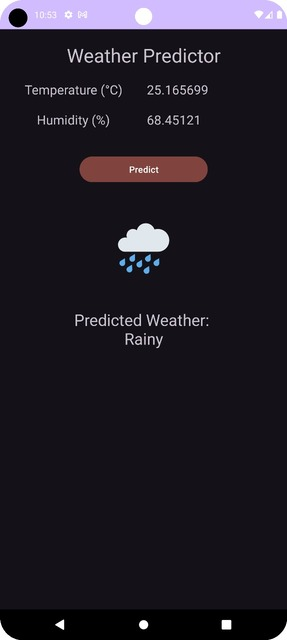

# IoT Weather Predictor App

This Android app fetches real-time temperature and humidity data from IoT devices via Azure Blob Storage and predicts weather conditions using a machine learning model, implemented with TensorFlow Lite.




## Prerequisites
+ Your PC should have Android Studio installed.
+ An Android Phone (or you may install and test the app on a virtual device)

## Features

+ Predicts weather conditions based on temperature and humidity
+ Integrates TensorFlow Lite models on Android Devices
+ Provides visual feedback with weather icons for predicted conditions

## Installation

+ Clone this repository to your local machine using 'git clone'.
+ Open the project in Android Studio.
+ Build and run the application on an Android device or emulator.

## Usage

+ Enter the temperature and humidity values.
+ Tap the "Predict" button to fetch the latest sensor data.
+ The application will display the fetched temperature and humidity values and the predicted weather condition along with a corresponding weather icon.

# Steps for Development


# ML Part
## DATASET
The data used for this model is a custom-made dataset built using python pandas. 
The dataset used is **indian_weather_dataset3.csv**, which contains the following columns:

•	**Temperature (°C)**

•	**Humidity (%)**

The sole reason for using such a simple dataset is because of its high interpretability. While using a large real-world dataset can improve the performance of our machine learning model and can help in making better predictions, the crux of this project is the integration of machine learning to Android applications. We the Android club expects the audience to learn the process through this event and bring even more complex ideas to life.

## MODEL DEVELOPMENT
This Python script demonstrates the process of building a machine learning model to predict weather conditions based on temperature and humidity data. The model uses a neural network built with TensorFlow and Keras, and is trained on a dataset of Indian weather conditions.
### **Features**
•	Data preprocessing with pandas and scikit-learn.
•	Neural network model creation with TensorFlow.
•	Model evaluation and predictions.
### **Dependencies**
•	Python 3.x
•	Pandas
•	NumPy
•	Matplotlib
•	TensorFlow
•	scikit-learn

### Neural Network Architecture
The model is built using TensorFlow's Keras API, which allows for an intuitive stack of layers using Sequential. The architecture comprises:
**Input Layer:** It takes the input with the shape corresponding to the number of features (2 in this case: temperature and humidity).
**Dense Layers:** Two hidden layers with 64 and 32 neurons respectively, both using ReLU activation functions. ReLU is chosen for its efficiency and effectiveness in adding non-linearity to the model.
**Output Layer:** The final layer has several neurons equal to the number of unique weather conditions, using a softmax activation function. Softmax makes the output sum up to one so the output can be interpreted as probabilities.

### Compilation
The model is compiled with the Adam optimizer and sparse categorical crossentropy as the loss function. Adam is preferred for its adaptive learning rate capabilities, making it suitable for data with varying scales. Sparse categorical crossentropy is used as the loss function because it is efficient with categorical target variables that are represented as integers.

## TFLITE CONVERSION
The decision to use TensorFlow Lite for IoT integration is driven by its efficiency and compatibility with edge devices. TensorFlow Lite models are tailored for deployment on resource-constrained platforms, offering optimal performance with minimal computational overhead. This makes it ideal for real-time applications like weather prediction on IoT devices. In simple language, tensorflow-lite models work efficiently in embedded devices like raspberry pi or android phones , without lagging and slowing the process. 

We start by importing necessary libraries.
•	**numpy** for numerical operations. 
•	**load_model** from keras.models to load our pre-trained weather prediction model stored in an HDF5 file. 
•	**os** for operating system functionalities. 
•	**tensorflow** library itself (tf) to utilize TensorFlow functionalities.

```python
    converter = tf.lite.TFLiteConverter.from_keras_model(model)
    tflite_model = converter.convert()
    INFO:tensorflow: Assets written to: C:\Users\soodv\AppData\Local\Temp\tmp13c6f28x\assets
```
 
Here we use the TensorFlow Lite Converter (tf.lite.TFLiteConverter) to convert our loaded Keras model (model) into a TensorFlow Lite compatible format. This step is essential for optimizing the model for deployment on mobile or edge devices.This line actually performs the conversion of our Keras model (model) into a TensorFlow Lite model.
Finally, we save the converted TensorFlow Lite model (tflite_model) into a file named Weather_predictor.tflite. The model is written in binary ('wb') mode into this file using the write() method of the file handler (f). This .tflite file can now be deployed and used efficiently on mobile devices or embedded systems.
Now you can look for the file in the file explorer and integrate it with the Android studio which would be discussed later.


# Android Part

## Libraries Used

+ TensorFlow Lite: For running machine learning models on Android.
+ Retrofit: For making network requests and handling REST API responses
+ Gson: For parsing JSON responses into Kotlin data classes
+ All other minor dependencies are specified in the [build.gradle file](https://github.com/adsmehra/IOT-Weather-Predictor/blob/main/app/build.gradle.kts).

## Flow diagram of the model


# UI XML File
How your app looks is specified in the activity_main.xml [here](app/src/main/res/layout/activity_main.xml)

## Dependencies 
### For TensorFlow
```
    implementation("org.tensorflow:tensorflow-lite-support:0.1.0")
    implementation("org.tensorflow:tensorflow-lite-metadata:0.1.0")
    implementation("org.tensorflow:tensorflow-lite-gpu:2.3.0")

````
### For Retrofit and Gson
```
    implementation 'com.squareup.retrofit2:retrofit:2.9.0'
    implementation 'com.squareup.retrofit2:converter-gson:2.9.0'
    implementation 'com.google.code.gson:gson:2.8.8'

```
## Import TensorFlow Interpreter
```kotlin
    import org.tensorflow.lite.Interpreter
```

# Weather-Predictor Model access
You can get the model from "asset" section or follow the link -> [Tflite file](https://github.com/adsmehra/IOT-Weather-Predictor/blob/main/app/src/main/assets/Weather_predictor.tflite)

# JSON Snippet 

The provided [json Snippet](https://sensor1data.blob.core.windows.net/onlinesensordata/0_161b469607c84a04a037505b8ebeaca3_1.json?zin++eomthOe501JF2P7VJefVr646GhbuCMbqaMyMfdl59eH6n3fwIbGKzuzbnfyg61aRqE1cjsv+ASt5YbUjQ==) contains a series of temperature and humidity data readings from a device named "Iot-Raspberry". Each entry includes the temperature and humidity values along with additional metadata such as the event processing time, partition ID, and IoT Hub information. These readings are timestamped events, likely collected periodically from a sensor or IoT device. The data is organized in chronological order, showing the temperature and humidity measurements over time. This data could be utilized for various applications such as environmental monitoring, climate control, or predictive analytics.

## Import the ml file from the assets directory 
```kotlin
    import com.example.demo.ml.WeatherPredictor
```

## Import Retrofit
```kotlin
    import retrofit2.Call
    import retrofit2.Callback
    import retrofit2.Response
    import retrofit2.Retrofit
    import retrofit2.converter.gson.GsonConverterFactory
```

# Code Snippets

## SensorData Class
+ The SensorData class defines the structure of sensor data fetched from Azure Blob Storage, including temperature, humidity, and IoT Hub details.
```kotlin
data class SensorData(
    val temperature: Double,
    val humidity: Double,
    val EventProcessedUtcTime: String,
    val PartitionId: Int,
    val EventEnqueuedUtcTime: String,
    val IoTHub: IoTHub
)
```
## IoTHubData Class
+ The IoTHub class contains IoT Hub-specific information like message and device IDs. 
```kotlin
data class IoTHub(
    val MessageId: String?,
    val CorrelationId: String?,
    val ConnectionDeviceId: String,
    val ConnectionDeviceGenerationId: String,
    val EnqueuedTime: String
)
```
## API Service Interface
+ This ApiService interface defines a Retrofit API for fetching sensor data from a JSON file hosted on a server.
+ It specifies a GET request to retrieve a list of SensorData objects from the specified JSON file.
```kotlin
import retrofit2.Call
import retrofit2.http.GET

interface ApiService {
    @GET("<YOUR_JSON_FILE_NAME>") //Json file name
    fun getSensorData(): Call<List<SensorData>>
}
```

## MainActivity

### Main onCreate Method

Here, We:
+ Initialize our UI Components,
+ Create variables for our cloud IOT data,
+ We then provide this data to our TFLite file for processing,
+ Throughout, we use Exception Handling to make sure we avoid errors.

#### Retrofit Setup
+ The following code initializes Retrofit with a base URL and an access key, creates a service for making API calls, and defines a method for fetching sensor data.
```kotlin
        val baseUrl = "https://<YOUR_ACCOUNT_NAME>.blob.core.windows.net/<YOUR_BLOB_STORAGE_NAME>/"
        val accKey =
            "<YOUR_ACCOUNT_KEY>"

        val retrofit = Retrofit.Builder()
            .baseUrl("$baseUrl?${accKey}")
            .addConverterFactory(GsonConverterFactory.create())
            .build()
        val service = retrofit.create(ApiService::class.java)
```

### Fetch Data fun
+ Makes an asynchronous API call using Retrofit's enqueue method.
+ Parses the response to extract the latest sensor data (temperature and humidity).
+ Returns a FloatArray containing the temperature and humidity values.

```kotlin
    private fun fetchData(service: ApiService) {
        service.getSensorData().enqueue(object : Callback<List<SensorData>> {
            override fun onResponse(
                call: Call<List<SensorData>>,
                response: Response<List<SensorData>>
            ) {
                if (response.isSuccessful) {
                    val sensorDataList = response.body()
                    if (!sensorDataList.isNullOrEmpty()) {
                        val latestSensorData = sensorDataList[0]
                        val temperature = latestSensorData.temperature.toFloat()
                        val humidity = latestSensorData.humidity.toFloat()

                        temptv.text = temperature.toString()
                        humidtv.text = humidity.toString()

                        val weather = predictWeather(temperature, humidity)
                        var weatherIcon = 0
                        when(weather){
                            "Sunny" -> weatherIcon = R.drawable.sunny
                            "Cloudy" -> weatherIcon = R.drawable.cloudy
                            "Partly Cloudy" -> weatherIcon = R.drawable.partly_cloudy
                            "Rainy" -> weatherIcon = R.drawable.rainy
                            "Cold" -> weatherIcon = R.drawable.cold
                        }
                        resultTv.text = "Predicted Weather: \n" + weather
                        resultTv.setCompoundDrawablesRelativeWithIntrinsicBounds(0,weatherIcon,0,0)
                    } else {
                        Log.d("SensorData", "Sensor data list is null or empty")
                    }
                } else {
                    Log.e("API Call", "Failed to fetch data: ${response.message()}")
                }
            }

            override fun onFailure(call: Call<List<SensorData>>, t: Throwable) {
                Log.e("API Call", "Failed to fetch data", t)
            }
        })
    }

```

### Loading Tensorflow model
+ Used to access the the tflite file from assets folder and create an inputstream for it
+ Creates a channel to pass the inputs to the model
+ Declares startOffset and length of the file
+ Returns a MappedByteBuffer for the data in the model
  
```kotlin
private fun loadModelFile(): ByteBuffer {
        val fileDescriptor: AssetFileDescriptor = assets.openFd("Weather_predictor.tflite")
        val inputStream = FileInputStream(fileDescriptor.fileDescriptor)
        val fileChannel = inputStream.channel
        val startOffset = fileDescriptor.startOffset
        val declareLength = fileDescriptor.declaredLength
        return fileChannel.map(FileChannel.MapMode.READ_ONLY, startOffset, declareLength)
    }
```

### Predict Weather fun
+ Takes temperature (in Celsius) and humidity (in percentage) as inputs.
+ Uses a TensorFlow Lite model to predict the weather condition.
+ Returns the predicted weather condition (Sunny, Cloudy, Partly Cloudy, Rainy, Cold).

```kotlin
    private fun predictWeather(temperatureC: Float, humidityPer: Float): String {
    val byteBuffer =
        ByteBuffer.allocateDirect(2 * 4) // Assuming 2 input features and 4 bytes per float
    byteBuffer.order(ByteOrder.nativeOrder())
    val inputFeature0 = byteBuffer.asFloatBuffer()
    inputFeature0.put(floatArrayOf(temperatureC, humidityPer))
    byteBuffer.rewind()

    // Runs model inference and gets result.
    val outputs = Array(1) { FloatArray(5) }
    tflite.run(inputFeature0, outputs)

    val maxIndex = outputs[0].indices.maxByOrNull { outputs[0][it] } ?: -1
    val predictedClassIndex = if (maxIndex != -1) maxIndex else 0

    val weatherConditions =
        arrayOf("Cloudy", "Cold", "Rainy", "Sunny", "Partly Cloudy")
    val predictedWeather = weatherConditions[predictedClassIndex]
    Log.d("Weather", "Predicted: $predictedClassIndex")

    return predictedWeather

}


```


